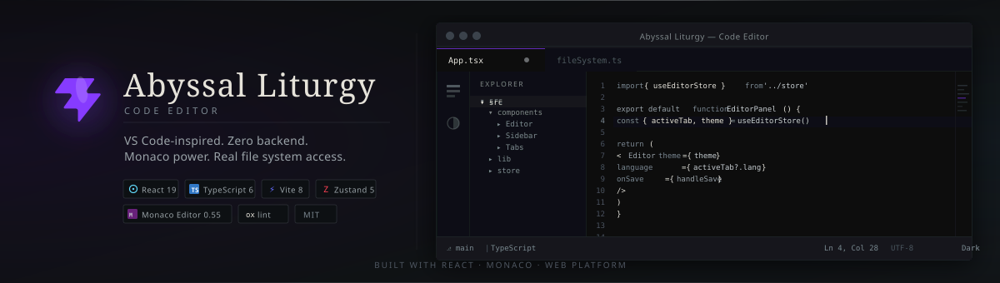

<div align="center">



<br/>


<br/>


<br/><br/>

<p align="center">
A VS Code-inspired, fully browser-based code editor.<br/>
Zero backend. Real file system access. Monaco power.
</p>

[Get Started](#-getting-started) &nbsp;·&nbsp; [Features](#-features) &nbsp;·&nbsp; [Architecture](#-architecture) &nbsp;·&nbsp; [Browser Support](#-browser-support) &nbsp;·&nbsp; [Contributing](#-contributing)

---

</div>

## Features

<table>
<tr>
<td width="50%" valign="top">

**Monaco at the Core**<br/>
The same engine powering VS Code. Bracket colorization, minimap, smooth cursor animations, multi-cursor editing, and an IntelliSense-ready architecture. No compromise on editing quality.

</td>
<td width="50%" valign="top">

**Auto Language Detection**<br/>
Drop any file -- TypeScript, Python, Rust, SQL, YAML, GraphQL, and 30+ more -- and the language mode resolves automatically from the file extension. Zero configuration.

</td>
</tr>
<tr>
<td width="50%" valign="top">

**Real Folder Explorer**<br/>
Open an entire project directory and navigate it in a familiar tree. Directories expand lazily. `node_modules` and `.git` are hidden by default. The tree refreshes as files change on disk.

</td>
<td width="50%" valign="top">

**Multi-Tab Workflow**<br/>
Work across multiple files simultaneously. Each tab carries its own independent undo/redo history. Unsaved changes surface as a dot indicator; you will never accidentally close a dirty file.

</td>
</tr>
<tr>
<td width="50%" valign="top">

**True Save -- Back to Disk**<br/>
`Ctrl+S` writes directly to the original file on your file system. No download prompt, no copy-paste. **Save As** and single-file **Open** are also supported with full handle management.

</td>
<td width="50%" valign="top">

**Dark and Light Theme**<br/>
Switch between Abyssal Liturgy Dark and Light with a single click from the activity bar. Theme applies globally across the editor, sidebar, tabs, and status bar in real time.

</td>
</tr>
<tr>
<td width="50%" valign="top">

**Graceful Fallbacks**<br/>
No File System Access API? No problem. On Firefox and Safari the editor falls back to `<input type="file">` for opening and triggers a download on save -- same editing experience, adapted I/O.

</td>
<td width="50%" valign="top">

**Toast Notifications**<br/>
Non-intrusive feedback for every important action -- saved, error, info -- with auto-dismiss. No dialog boxes, no interruptions to your flow.

</td>
</tr>
</table>

---

## Getting Started

> **Prerequisites:** Node.js 18+ and npm. For full folder access use **Chrome** or **Edge**.

```bash
# 1 -- Clone
git clone https://github.com/your-org/code-editor.git
cd code-editor

# 2 -- Install
npm install

# 3 -- Develop
npm run dev
```

Open the printed URL (typically `http://localhost:5173`) in Chrome or Edge for the full experience.

```bash
npm run build    # TypeScript check + Vite bundle
npm run preview  # Preview production output locally
npm run lint     # oxlint -- fast Rust-based linter
```

---

## Architecture

State is held in a single flat **Zustand store** (`useEditorStore`). Components subscribe only to the slices they need, keeping re-renders minimal and updates predictable.

```
+-------------------------------------------------------+
|                        App.tsx                        |
|   TitleBar . ActivityBar . Sidebar . TabBar . Editor  |
|                       StatusBar                       |
+------------------------+------------------------------+
                         |  reads / dispatches
                         v
              +---------------------+
              |   useEditorStore    |  Zustand
              |   tabs[]            |
              |   activeTabId       |
              |   rootNode          |
              |   theme             |
              |   toast             |
              +----------+----------+
                         |  calls
           +-------------+-------------+
           v                           v
   lib/fileSystem.ts         lib/languageDetect.ts
   FSAA wrapper + fallbacks   ext -> Monaco language ID
```

---

## Project Structure

```
code-editor/
+-- public/
|   +-- favicon.svg               App icon
|   +-- icons.svg                 SVG sprite sheet
|
+-- src/
|   +-- components/
|   |   +-- ActivityBar/          Left icon strip (explorer toggle, theme toggle)
|   |   +-- Sidebar/              Folder explorer + lazy file tree
|   |   +-- Tabs/                 Open-file tab bar with dirty indicators
|   |   +-- Editor/               Monaco wrapper + Ctrl+S save logic
|   |   +-- StatusBar/            Bottom bar (language, cursor position)
|   |   +-- Toast/                Auto-dismiss notification toasts
|   |   +-- TitleBar.tsx          Top title bar
|   |
|   +-- lib/
|   |   +-- fileSystem.ts         File System Access API wrapper + fallbacks
|   |   +-- languageDetect.ts     Extension to Monaco language ID (30+ langs)
|   |   +-- monacoSetup.ts        Monaco initialization and worker config
|   |
|   +-- store/
|   |   +-- useEditorStore.ts     Zustand store: tabs, tree, theme, toasts
|   |
|   +-- types/
|   |   +-- index.ts              Shared TypeScript types + FSAA augmentations
|   |
|   +-- App.tsx                   Root layout, theme sync, beforeunload guard
|   +-- main.tsx                  React 19 entry point
|   +-- index.css                 Global CSS reset + design tokens
|
+-- vite.config.ts
+-- tsconfig.json
+-- package.json
+-- README.md
```

---

## Browser Support

| Browser | Open Folder | In-Place Save | Open File | Save (Download) |
|:-------:|:-----------:|:-------------:|:---------:|:---------------:|
| Chrome | yes | yes | yes | yes |
| Edge | yes | yes | yes | yes |
| Brave | yes | yes | yes | yes |
| Firefox | -- | -- | yes (upload) | yes |
| Safari | -- | -- | yes (upload) | yes |

Open Folder and direct Save require the [File System Access API](https://developer.mozilla.org/en-US/docs/Web/API/File_System_Access_API), a Chromium-only capability. The editor detects support at runtime and adjusts automatically; Firefox and Safari users get a seamless upload/download flow.

---

## Supported Languages

`JavaScript` · `TypeScript` · `JSX / TSX` · `JSON / JSONC` · `HTML` · `CSS` · `SCSS` · `Less` · `Markdown` · `Python` · `Ruby` · `PHP` · `Java` · `C` · `C++` · `C#` · `Go` · `Rust` · `Swift` · `Kotlin` · `SQL` · `Shell / Bash` · `YAML` · `XML` · `SVG` · `TOML` · `INI` · `Dockerfile` · `GraphQL` · `Vue` · `Lua` · `R`

Language is inferred from the file extension automatically. No manual picker, no configuration.

---

## Keyboard Shortcuts

| Shortcut | Action |
|----------|--------|
| `Ctrl+S` / `Cmd+S` | Save to disk (in-place if opened via handle) |
| `Ctrl+Shift+S` / `Cmd+Shift+S` | Save As, choose a new location |
| `Ctrl+W` / `Cmd+W` | Close active tab |
| `Ctrl+Tab` | Cycle to next tab |
| `Ctrl+\`` | Toggle sidebar |
| All standard Monaco bindings | Multi-cursor, find / replace, fold, format, ... |

---

## Tech Stack

| Layer | Technology |
|-------|-----------|
| UI Framework | [React 19](https://react.dev/) |
| Language | [TypeScript 6](https://www.typescriptlang.org/) |
| Build | [Vite 8](https://vite.dev/) |
| Editor Engine | [Monaco Editor 0.55](https://microsoft.github.io/monaco-editor/) via `@monaco-editor/react` |
| State | [Zustand 5](https://zustand-demo.pmnd.rs/) |
| Linter | [oxlint](https://oxc.rs/docs/guide/usage/linter.html) |
| Styling | CSS Modules + CSS custom properties |
| File I/O | [File System Access API](https://developer.mozilla.org/en-US/docs/Web/API/File_System_Access_API) with fallback |

---

## Contributing

Bug reports, feature requests, and pull requests are welcome.

1. Fork the repository
2. Create a feature branch: `git checkout -b feat/my-feature`
3. Commit: `git commit -m 'feat: add my feature'`
4. Push: `git push origin feat/my-feature`
5. Open a Pull Request

Run `npm run lint` before submitting and keep PRs focused on a single concern.

---

## License

MIT -- see [`LICENSE`](LICENSE).

<div align="center">
<br/>
<sub>Abyssal Liturgy &nbsp;·&nbsp; built with React, Monaco, and the Web Platform</sub>
</div>
